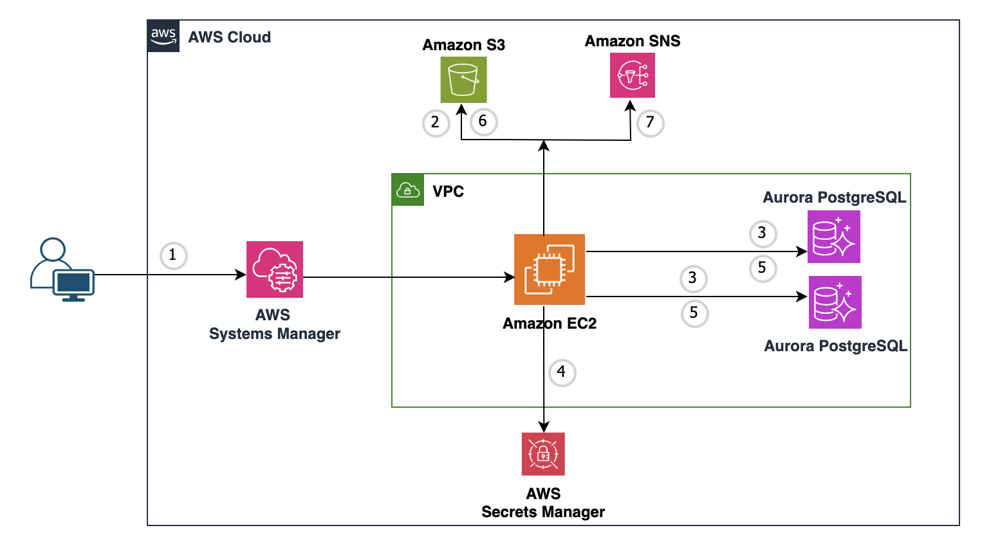
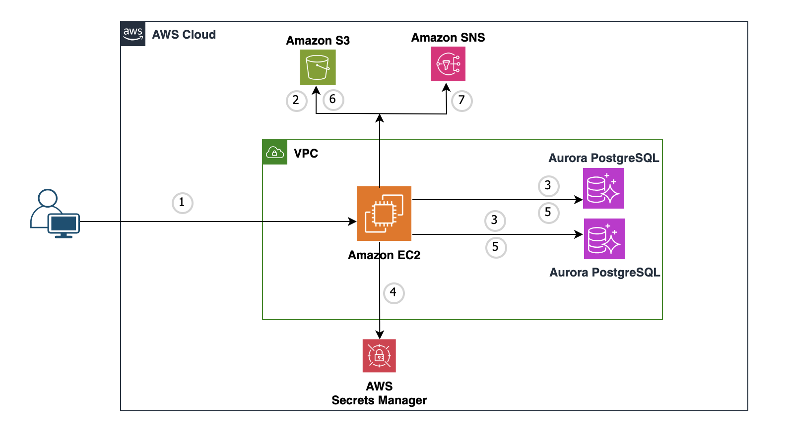
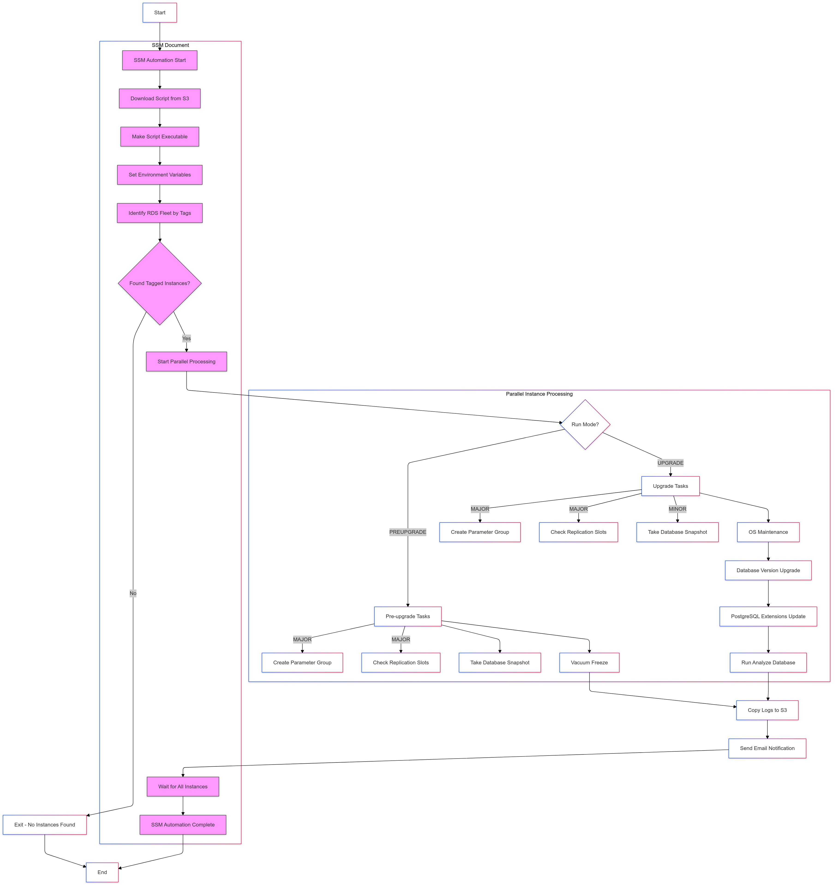
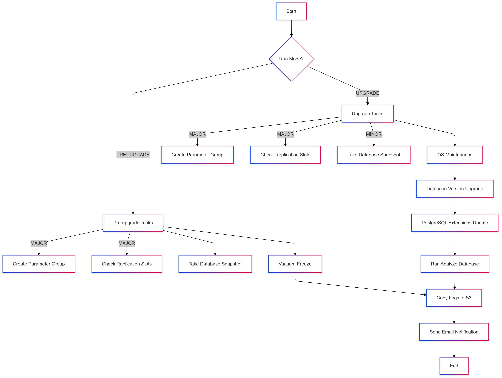
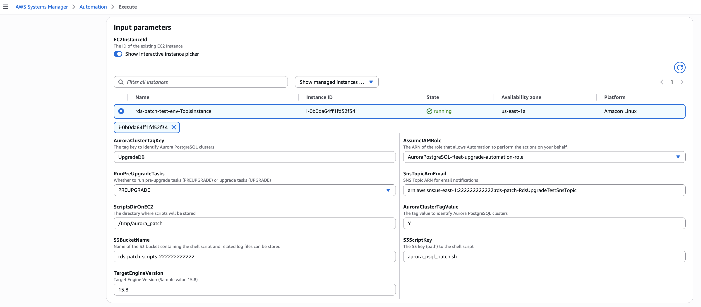
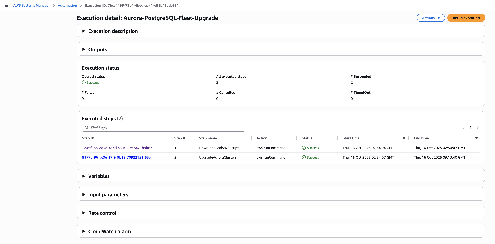
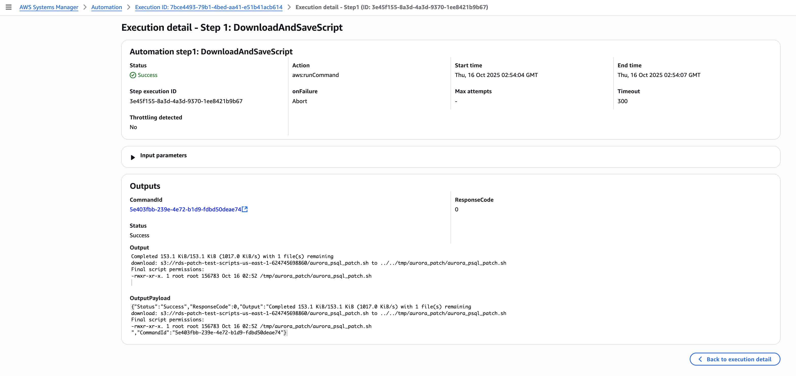
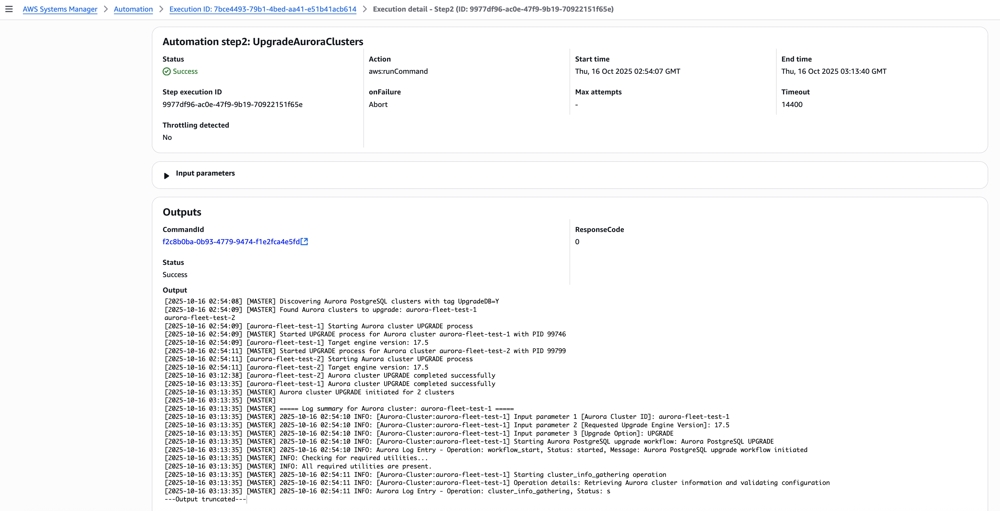

# Automate PostgreSQL Version Upgrades on Amazon Aurora

Managing the lifecycle of your Aurora PostgreSQL cluster is essential for maintaining optimal performance, security, and feature access. Even with Amazon Aurora for PostgreSQL simplifying operations, version upgrades remain a critical task for database engineers, especially in large-scale deployments. Manual upgrades can introduce challenges such as extended downtime and potential human errors, both of which can disrupt application stability.

Automation can help address these challenges. By leveraging AWS Command Line Interface (CLI) commands within a Unix shell script, you can automate the upgrade process, including prerequisite checks and upgrading a single Aurora cluster. To scale this approach for multiple clusters, you can integrate with AWS System Manager using Aurora cluster tag strategy to upgrade entire fleet of Aurora clusters across multiple environments—such as Development, Staging, and Production—in a consistent and automated manner.

This repository will guide you through setting up automation for pre-upgrade checks and upgrading one or more Aurora PostgreSQL clusters.

<br>

## Table of Contents
- [Features](#features)
- [Architecture](#architecture)
  - [Upgrade fleet of Aurora PostgreSQL clusters using AWS Systems Manager](#upgrade-fleet-of-aurora-postgresql-clusters-using-aws-systems-manager)
  - [Upgrade a single Aurora PostgreSQL cluster directly from EC2](#upgrade-a-single-aurora-postgresql-cluster-directly-from-ec2)
- [High-level Tasks with PREUPGRADE and UPGRADE options](#high-level-tasks-with-preupgrade-and-upgrade-options)
  - [PREUPGRADE Tasks](#preupgrade-tasks)
  - [UPGRADE Tasks](#upgrade-tasks)
- [Flow Charts](#flow-charts)
  - [Upgrade fleet of Aurora PostgreSQL clusters using AWS Systems Manager](#upgrade-fleet-of-aurora-postgresql-clusters-using-aws-systems-manager-1)
  - [Upgrade a single Aurora PostgreSQL cluster directly from EC2](#upgrade-a-single-aurora-postgresql-cluster-directly-from-ec2-1)
- [Setup](#setup)
  - [Setup - Upgrade fleet of Aurora PostgreSQL clusters using AWS Systems Manager](#setup---upgrade-fleet-of-aurora-postgresql-clusters-using-aws-systems-manager)
  - [Setup - Upgrade a single Aurora PostgreSQL cluster directly from EC2](#setup---upgrade-a-single-aurora-postgresql-cluster-directly-from-ec2)
- [Testing](#testing)
- [Log Files](#log-files)
- [Conclusion](#conclusion)

<br>

## Features

- Automate Amazon Aurora PostgreSQL version upgrades
- Perform prerequisite checks before upgrading
- Upgrade a single Aurora cluster
- Scale the upgrade process to multiple Aurora PostgreSQL clusters
- Integrate with AWS System Manager for fleet-wide upgrades
- Copy-on-write cluster cloning for fast rollback capability
- Comprehensive logging and monitoring

<br>

## Architecture

## Upgrade fleet of Aurora PostgreSQL clusters using AWS Systems Manager



      1. User connects to AWS Systems Manager console and execute automation job
      2. Connects to S3 and downloads the upgrade shell script to ec2 instance
      3. Connects to ec2 instance and identifies list of Aurora PostgreSQL clusters based on tag key/value pair: For e.g.: UpgradeDB = Y
      4. For each Aurora PostgreSQL cluster identified, configures Aurora cluster to push DB and upgrade logs to CloudWatch if not configured already
      5. Retrieves secret from secret manager
      6. Performs upgrade
      7. Pushes log files to S3
      8. Sends email notification.

<br>

## Upgrade a single Aurora PostgreSQL cluster directly from EC2



      1. User connects to EC2 and executes the upgrade script
      2. Checks if Aurora cluster is valid
      3. Configures Aurora cluster to push DB and upgrade logs to CloudWatch if not configured already
      4. Retrieves secret from secret manager
      5. Performs upgrade tasks
      6. Pushes log files to S3
      7. Sends email notification.

<br>

## High-level Tasks with PREUPGRADE and UPGRADE options

### PREUPGRADE Tasks

      1. Create new cluster parameter group when upgrade type = Major
      2. Create new instance parameter group when upgrade type = Major
      3. Check replication slot(s) when upgrade type = Major
      4. Take cluster snapshot
      5. Vacuum freeze on writer endpoint.

<br>

### UPGRADE Tasks

      1. Create copy-on-write cluster clone for fast rollback capability
      2. Create new cluster parameter group when upgrade type = Major
      3. Create new instance parameter group when upgrade type = Major
      4. Take cluster snapshot when upgrade type = Minor (for Major, pre-upgrade snapshot is taken by default during cluster upgrade)
      5. Drop replication slot(s) when upgrade type = Major if variable cluster_drop_replication_slot is set to Y
      6. OS maintenance (pending maintenance) on all cluster instances
      7. Aurora cluster version upgrade
      8. PostgreSQL extensions update on writer endpoint
      9. Run analyze database on writer endpoint.
      
<br>

<details>

<summary><b>Click to expand/collapse Flow Charts</b></summary>

## Flow Charts

### Upgrade fleet of Aurora PostgreSQL clusters using AWS Systems Manager


### Upgrade a single Aurora PostgreSQL cluster directly from EC2


</details>

<br>

## Setup

### Setup - Upgrade fleet of Aurora PostgreSQL clusters using AWS Systems Manager

1. Prerequisites
   
   ```
     a. AWS resources required:
   
        i. EC2 instance primarily to store and run upgrade script, and store log files.
   
               - Required Tools:
                     -- AWS CLI
                     -- PostgreSQL client utility
                     -- jq for JSON processing
                     -- bc (basic calculator utility)

                   Below commands can be used to install these utilities if required.
   
                       sudo yum install -y epel-release
                       sudo yum install -y bc jq
                       sudo yum install -y postgresql15
                       which bc jq psql

        ii. IAM profile attached to EC2 instance with necessary permissions.
   
                - Refer to [create_ssm_aurora_patch_automation_document.yaml] file for required permissions.
                         Note: Modify resource names appropriately
   
                - Attach this IAM role to ec2 instance

        iii. Aurora PostgreSQL cluster(s) with:
   
                - VPC configuration
                - Subnet group(s)
                - Security group(s)
                - Cluster and instance parameter groups
                - AWS Secrets Manager secret attached to each Aurora cluster
                - Refer to [create_aurora_psql_cluster_cfn.yaml] file for required permissions.
                      Note: Modify resource names appropriately
      
        vi. S3 bucket to store scripts and logs (optional)
   
        v. SNS topic for notifications (optional)

     b. Network Configuration.
   
        - Aurora cluster security group must allow inbound traffic from EC2 instance

2. Upload unix shell script *[aurora_psql_patch.sh]* from this repo to S3 bucket

3. Create maintenance database user account in Aurora PostgreSQL cluster like below. This is required to create/drop replication slots, run analyze and vacuum commands, and upgrade pg extensions. This is to avoid using Aurora master user account.

      ```
            CREATE USER aurora_maintenance_user WITH PASSWORD 'xxxxxxxxxxxxxxx';
            GRANT rds_superuser TO aurora_maintenance_user;
      ```

4. Create a secret to store database maintenance user credentials using below AWS CLI command.

    ```
      - Sample AWS CLI command to create secret
      aws secretsmanager create-secret \
            --name "<Aurora Cluster ID>-maintenance-user-secret" \
            --description "Maintenance user credentials for Aurora PostgreSQL cluster" \
            --secret-string "{\"username\":\"aurora_maintenance_user\",\"password\":\"xxxxxxxxxxxxxxx\"}"
    ```

5. Add a tag to Aurora PostgreSQL cluster using AWS CLI command. This is required for the upgrade process to perform maintenance tasks in the database that are part of this upgrade.

    ```
      - Expected Aurora cluster tags for secret
            - Tag Name: aurora-maintenance-user-secret
            - Secret Name: <Aurora Cluster ID>-maintenance-user-secret            
            - DB Maintenance User Name: aurora_maintenance_user

      - Sample AWS CLI command to add secret tag to an Aurora PostgreSQL cluster
      aws rds add-tags-to-resource \
            --resource-name arn:aws:rds:<AWS-REGION>:<AWS-ACCOUNT-NUMBER>:cluster:<Aurora Cluster ID> \
            --tags Key=UpgradeDB,Value=Y Key=Environment,Value=Test Key=aurora-maintenance-user-secret,Value=<Aurora Cluster ID>-maintenance-user-secret
    ```
    
6. Create SSM automation document using CFN *[create_ssm_aurora_patch_automation_document.yaml]*
         Note: Modify resource names appropriately

7. Identify minor or major upgrade path. Below is an example AWS CLI command to identify appropriate upgrade path for Aurora PostgreSQL 16.3.
 
      ```
            aws rds describe-db-engine-versions \
              --engine aurora-postgresql \
              --engine-version 16.3 \
              --query "DBEngineVersions[].ValidUpgradeTarget[].{EngineVersion:EngineVersion,IsMajorVersionUpgrade:IsMajorVersionUpgrade}" \
              --output table

            --------------------------------------------
            |         DescribeDBEngineVersions         |
            +----------------+-------------------------+
            |  EngineVersion |  IsMajorVersionUpgrade  |
            +----------------+-------------------------+
            |  16.4          |  False                  |
            |  16.6          |  False                  |
            |  16.8          |  False                  |
            |  16.9          |  False                  |
            |  17.4          |  True                   |
            |  17.5          |  True                   |
            +----------------+-------------------------+

            Based on the above output:
      
                  - For version 16.3, 16.4 thru 16.9 are valid minor version upgrade paths.
                  - For version 16.3, 17.4 thru 17.5 are valid major version upgrade paths.
      ```

8. Execute SSM automation document "Aurora-PostgreSQL-Fleet-Upgrade"
      - Identify major or minor version upgrade path as shown in the previous section
      - Provide appropriate input parameters. See below screenshots.
            -- Input parameters in SSM console
            

            -- SSM automation job: Status
      
            
            -- SSM automation steps (1 and 2): Status
      
      

<br>

### Setup - Upgrade a single Aurora PostgreSQL cluster directly from EC2

1. Prerequisites from the above section apply to this section as well.
   
2. Clone the repository.
   ```
   git clone https://github.com/aws-samples/aurora-postgres-upgrade.git
   ```
   
3. Navigate to the project directory.
   ```
   cd aurora-postgres-upgrade
   ```

4. Grant execute permission on the shell script.

   ```
   chmod u+x aurora_psql_patch.sh
   ```

5. Identify minor or major upgrade path as mentioned in the above section.

6. Update environment variables in the shell script *[aurora_psql_patch.sh]*, if required (optional).

7. Execute upgrade process.

      a. Set up log file location in the environment (optional).
         If this variable is not set, log files will not be copied over to S3 bucket.
   
            export S3_BUCKET_PATCH_LOGS="<s3-bucket-name>"
   
            e.g.: export S3_BUCKET_PATCH_LOGS="s3-aurora-psql-patch-test-bucket"
   
      b. Configure email notification (optional).
         If this variable is not set, this process will not send notification at the end of this upgrade process.
   
            export SNS_TOPIC_ARN_EMAIL="<sns-topic-arn>"
   
            e.g.: export SNS_TOPIC_ARN_EMAIL="arn:aws:sns:us-east-1:11111111111:sns-aurora-psql-patch-test-sns-topic"
           
      c. Execute upgrade script.

               ./aurora_psql_patch.sh [cluster-identifier] [next-engine-version] [run-pre-check]
   
               e.g.: ./aurora_psql_patch.sh aurora-cluster-test-1 16.3 PREUPGRADE

               PREUPGRADE = Run pre-requisite tasks, and do NOT run upgrade tasks
               UPGRADE = Do not run pre-requisite tasks, but run upgrade tasks
      
               Note: Review this document [https://docs.aws.amazon.com/AmazonRDS/latest/AuroraUserGuide/AuroraPostgreSQL.Updates.html]
                     for appropriate minor or major supported version (a.k.a appropriate upgrade path)
      
8. Example Usage:
   
           a. Preupgrade process execution:

               export S3_BUCKET_PATCH_LOGS="s3-aurora-psql-patch-test-bucket"
               export SNS_TOPIC_ARN_EMAIL="arn:aws:sns:us-east-1:11111111111:sns-aurora-psql-patch-test-sns-topic"
               nohup ./aurora_psql_patch.sh aurora-cluster-test-1 16.3 PREUPGRADE >aurora-cluster-test-1-preupgrade-`date +'%Y%m%d-%H-%M-%S'`.out 2>&1 &

           b. Upgrade process execution

               export S3_BUCKET_PATCH_LOGS="s3-aurora-psql-patch-test-bucket"
               export SNS_TOPIC_ARN_EMAIL="arn:aws:sns:us-east-1:11111111111:sns-aurora-psql-patch-test-sns-topic"
               nohup ./aurora_psql_patch.sh aurora-cluster-test-1 16.3 UPGRADE >aurora-cluster-test-1-upgrade-`date +'%Y%m%d-%H-%M-%S'`.out 2>&1 &

<br>

## Testing
To perform end-to-end testing of this process using AWS System Manager, perform below steps using AWS Console:

**Note**: This will create VPC, subnets, routes, ec2, Aurora cluster, security groups, IAM policy/role, NAT, IGW, EIP and others. 

1. Run CloudFormation script [create_aurora_psql_cluster_cfn.yaml] to create complete test stack with input parameter values.

2. Run CloudFormation script [create_ssm_aurora_patch_automation_document.yaml] to create SSM automation document.

3. Upload Aurora patch shell script [aurora_psql_patch.sh] to S3 bucket created in Step 1 above.

4. Create maintenance database user account in Aurora PostgreSQL cluster like below. This is required to create/drop replication slots, run analyze and vacuum commands, and upgrade pg extensions. This is to avoid using Aurora master user account. 

Note:
Use the same password that is in the "<Aurora Cluster ID>-maintenance-user-secret" secret which would have been created during Step #1 above.

      ```
            CREATE USER aurora_maintenance_user WITH PASSWORD 'xxxxxxxxxxxxxxx';
            GRANT rds_superuser TO aurora_maintenance_user;
      ```

5. Execute automation document from AWS Systems Manager console (as per Step 8 of the section "Upgrade fleet of Aurora PostgreSQL clusters using AWS Systems Manager").

Note: 
1. To create a replication slot in an Aurora PostgreSQL cluster, set rds.logical_replication=1 in the Aurora cluster parameter group and restart the cluster.
2. Then, use the command like "SELECT pg_create_logical_replication_slot('slot_aurora_patch_test','test_decoding');" to create a replication slot.
3. If one or few Aurora clusters fail during a fleet upgrade (for e.g. 100 clusters), the SSM automation job status will be marked as "failed".
   The logs will clearly indicate which specific clusters failed, allowing you to investigate and potentially retry just those clusters.

<br>

## Log Files

Below log files will be generated in the logs directory for each option

<br>

### Summary of logs for PREUPGRADE

|Log File Type|Sample File Name|Directory Path|Frequency|Purpose
|---------------|---------------|-------------------|-------------------|-------------------           
|Master Log|PREUPGRADE-master-20250321-21-55-51.log|[script-dir] is the directory where "aurora-psql-patch.sh" is saved|Each run|General information on pre-upgrade job tasks
|Pre-upgrade Status log|PREUPGRADE-status|[script-dir]/logs|Each run|Pre-upgrade Job status
|Pre-upgrade Execution Log|PREUPGRADE-20250321-21-51-48.log|[script-dir]/logs/[cluster-id]|Each run|Detail view of all pre-upgrade tasks
|Freeze Task Log|PREUPGRADE-run_aurora_db_task_freeze-20250321-21-55-52.log|[script-dir]/logs/[cluster-id]|Each run|Log on Vacuum Freeze
|Replication Slot Log|PREUPGRADE-aurora_replication_slot_20250321-21-55-52.log|[script-dir]/logs/[cluster-id]|For Major Version Upgrade only|Current Replication slot status and recommendations on actions to take before major version upgrade

<br>

### Summary of logs for UPGRADE

|Log File Type|Sample File Name|Directory Path|Frequency|Purpose/Error information
|---------------|---------------|-------------------|-------------------|-------------------           
|Master Log|UPGRADE-master-20250321-22-16-11.log|[script-dir]/logs|Each run|General information on upgrade tasks
|Upgrade Status log|UPGRADE-status|[script-dir]/logs/[cluster-id]|Each run|Upgrade Job Status
|Upgrade Execution Log|UPGRADE-20250321-22-16-11.log|[script-dir]/logs/[cluster-id]|Each run|Detail view of all Upgrade tasks
|Current Cluster Configuration Backup|cluster_current_config_backup_aurora-postgresql15-20250321-22-16-12.txt|[script-dir]/logs/[cluster-id]|Each run|Backup of current Aurora cluster configuration 
|Replication Slot Log|UPGRADE-aurora_replication_slot_20250321-22-16-12.log|[script-dir]/logs/[cluster-id]|For Major Version Upgrade Only|Current replication slot status and recommendations on actions to take before major version upgrade
|Extension Update Log|UPGRADE-update_aurora_db_extensions_20250321-22-16-12.log|[script-dir]/logs/[cluster-id]|Each run|Log on PostgreSQL extension updates
|Analyze Task Log|UPGRADE-run_aurora_db_task_analyze-20250321-22-16-12.log|[script-dir]/logs/[cluster-id]|Each run|Log on ANALYZE command execution

<br>

## Additional commands (if required)

1. Command to create Aurora maintenance user.

     ```
            CREATE USER aurora_maintenance_user WITH PASSWORD 'xxxxxxxxxxxxxxx';
            GRANT rds_superuser TO aurora_maintenance_user;
     ```

2. Command to create a replication slot.

      ```
            SELECT * FROM pg_replication_slots;
            SELECT pg_create_logical_replication_slot('my_slot', 'test_decoding');
            SELECT * FROM pg_replication_slots;
     ```

3. Command to drop all replication slots.

      ```
            SELECT * FROM pg_replication_slots;
            SELECT pg_drop_replication_slot(slot_name) FROM pg_replication_slots WHERE slot_name IN (SELECT slot_name FROM pg_replication_slots);
            SELECT * FROM pg_replication_slots;
     ```

4. Command to create multiple Aurora clusters to test this process.

      ```
            # Create multiple test clusters for fleet testing
            for i in {1..2}; do
            aws cloudformation create-stack \
                  --stack-name aurora-fleet-test-${i} \
                  --template-body file://cloudformation/create_aurora_psql_cluster_cfn.yaml \
                  --parameters \
                        ParameterKey=ClusterIdentifier,ParameterValue=aurora-fleet-test-${i} \
                        ParameterKey=EngineVersion,ParameterValue=16.3 \
                        ParameterKey=VpcId,ParameterValue=vpc-000aaaabbbccccdddeee \
                        ParameterKey=SubnetIds,ParameterValue=subnet-000aaaabbbccccdddeee\\,subnet-000aaaabbbccccdddeee \
                  --capabilities CAPABILITY_NAMED_IAM
            done

            # Wait for clusters to be available
            for i in {1..2}; do
            aws rds wait db-cluster-available --db-cluster-identifier aurora-fleet-test-${i}
            done

            # Tag clusters for fleet upgrade
            for i in {1..2}; do
            aws rds add-tags-to-resource \
                  --resource-name "arn:aws:rds:<AWS-REGION>:<AWS-ACCOUNT-NUMBER>:cluster:aurora-fleet-test-${i}" \
                  --tags Key=UpgradeDB,Value=Y Key=Environment,Value=Test Key=aurora-maintenance-user-secret,Value=aurora-fleet-test-${i}-maintenance-user-secret
            done
      ```
<br>

## Configuration Options

The Aurora PostgreSQL upgrade script supports several configuration options that can be set via environment variables:

### Core Configuration
- `cluster_clone_required="Y"` - Creates copy-on-write clone before UPGRADE operations (both MAJOR and MINOR)
- `cluster_snapshot_required="N"` - Creates manual snapshots for MINOR upgrades and MAJOR upgrades (PREUPGRADE phase only)
- `cluster_parameter_modify="N"` - Creates new cluster parameter groups for MAJOR upgrades only
- `instance_parameter_modify="N"` - Creates new instance parameter groups for MAJOR upgrades only
- `cluster_drop_replication_slot="Y"` - Automatically drop REPLICATION SLOTS during MAJOR upgrades only

### AWS Environment
- `S3_BUCKET_PATCH_LOGS=""` - S3 bucket for storing upgrade logs
- `SNS_TOPIC_ARN_EMAIL=""` - SNS topic ARN for email notifications
- `AWS_DEFAULT_REGION="us-west-2"` - AWS region for Aurora operations

### Override Examples
```bash
export cluster_clone_required="N"       # Disable copy-on-write clone creation
export cluster_snapshot_required="Y"    # Enable manual snapshots for all upgrades
export cluster_parameter_modify="Y"     # Create new parameter groups for MAJOR upgrades
export instance_parameter_modify="Y"    # Create new instance parameter groups for MAJOR upgrades
export cluster_drop_replication_slot="Y" # Auto-drop REPLICATION SLOTS for MAJOR upgrades
```

<br>

## Conclusion

The scalable solution automates Aurora PostgreSQL pre-upgrade and upgrade tasks, reducing manual effort and potential errors. With built-in logging and optional email notifications, it provides real-time visibility and comprehensive tracking. The copy-on-write cloning feature provides fast rollback capability in case of upgrade issues. By optionally storing logs in S3, you benefit from a cost-effective solution that ensures logs are readily available for analysis, audits, and compliance purposes.

<br>

## Disclaimer

We recommend you deploy and validate this solution in a non-production environment first prior to using it in production environment.

This README provides an overview of your script, including its purpose, how to use it, prerequisites, and a brief description of its functions and environment variables. It also includes some usage examples and notes about the script's behavior. You can adjust or expand this README as needed to provide more detailed information about your script.

<br>

## Contributing

Contributions are welcome! If you have any ideas, suggestions, or bug reports, please open an issue or submit a pull request.

<br>

## Security

See [CONTRIBUTING](CONTRIBUTING.md#security-issue-notifications) for more information.

<br>

## License

This library is licensed under the MIT-0 License. See the LICENSE file.